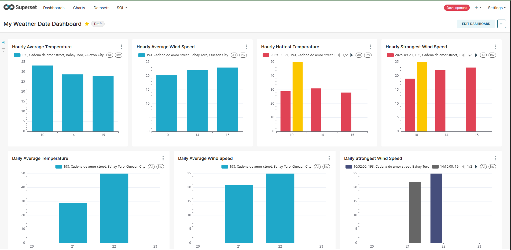
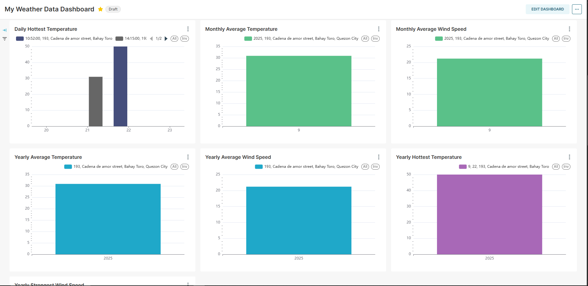
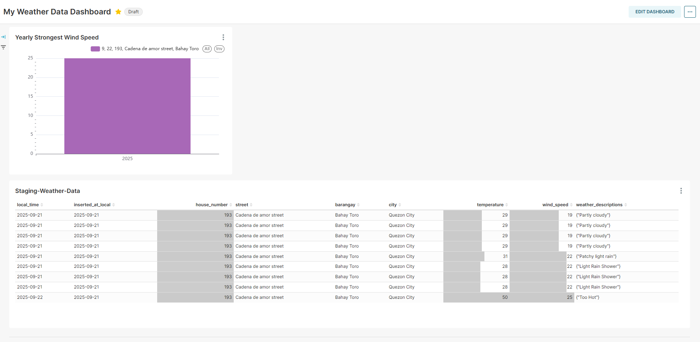
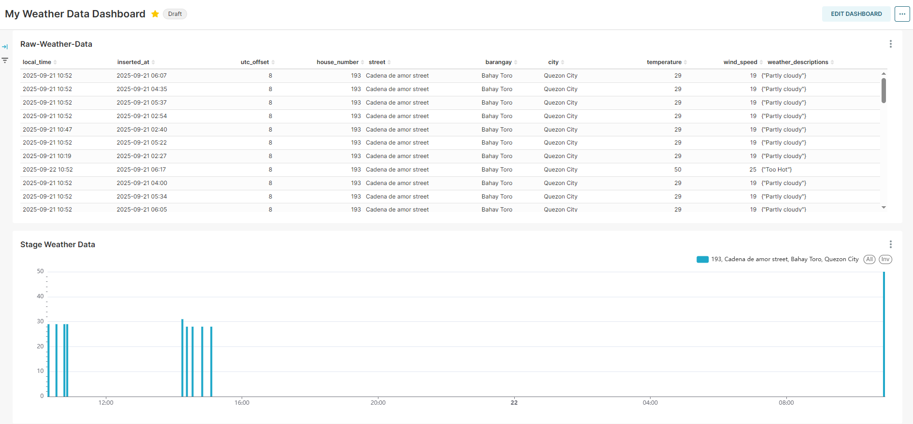

# Weather Data ETL Pipeline Project
Automated data pipeline that extracts, transforms, and loads weather data into a PostgreSQL database using Airflow and dbt, and Superset displays the final output

## Project Overview
This project automates the collection and processing of weather data. 
It fetches raw weather data from Weatherstack API, processes it using Python scripts, and runs transformations with dbt before loading it into PostgreSQL for analytics. 
The pipeline is scheduled and managed with Apache Airflow and containerized using Docker, and displayed the final output through Superset.

### Dashboard Preview
Here is an example Superset dashboard showing the processed weather metrics:



---

## Key Features
- Scheduled ETL pipeline using Airflow (PythonOperator & DockerOperator)
- Data transformation and modeling with dbt
- Automated daily aggregation of weather metrics
- Containerized using Docker and Docker Compose
- Displayed the final output using Superset

### My Dashboard Charts





---

## Technologies & Skills
- Python, SQL (PostgreSQL)
- Apache Airflow (DAGs, Operators, scheduling)
- Docker & Docker Compose
- dbt (data modeling & transformations)
- Apache Superset (visualization)

---

## How to Use the Project

### Prerequisites
Before running the project, make sure you have:

1. **Docker Desktop**  
   - Download and install for your platform: [https://docs.docker.com/desktop/](https://docs.docker.com/desktop/)  
   - Make sure Docker is **running** before continuing.

2. **Git**  
   - Required to clone the repository: [https://git-scm.com/downloads](https://git-scm.com/downloads)

---

### Step 1: Clone the Repository
- Go to Desktop
- Right Click then select (Open Git Bash here)
- Run the commands:

```bash
git clone https://github.com/Dan013577947/weather_data_project.git
cd weather_data_project

```
### Step 2: Start the Project with Docker
- Inside the project folder, run:

```bash
dos2unix docker/docker-init.sh
dos2unix docker/docker-bootstrap.sh
docker-compose up --build
```
- Wait for it to finish the setup

### Step 3: Access the Superset
- **user:** admin
- **password:** admin <br>

Open you browser and go to:

```bash
http://127.0.0.1:8088
```

## Step 4: Stop the Project

When finished, shut down all containers:

```bash
docker compose down
```
